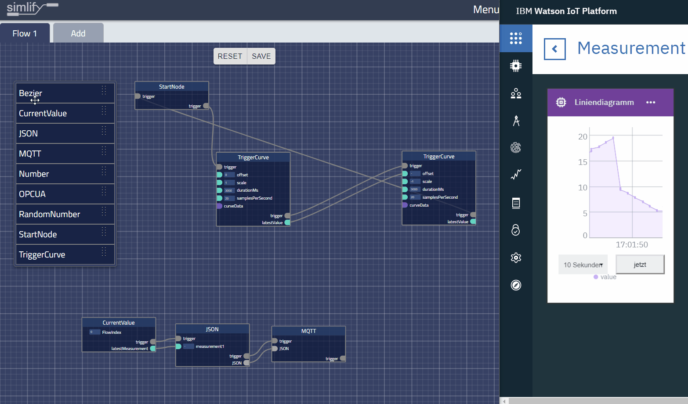

[](https://circleci.com/gh/simlify/simlify/tree/master)
[](https://codeclimate.com/github/codeclimate/codeclimate/maintainability)
[](https://lerna.js.org/)

# Simlify

Simplify your IoT Simulations.



## Developer

[NodeJS](https://nodejs.org/en/) has to be installed on your computer to start the program. Then follow these steps:

### Starting the whole application at once
1. Install development dependencies
```bash
npm install
```
2. Install dependencies and start the whole application
```bash
npm start
```

3. Access the dashboard [http://localhost:8080](http://localhost:8080)

### Starting the client and server individually (with webpack-dev-server)

1. Install development dependencies
```bash
npm install
```
2. Install dependencies
```bash
lerna bootstrap
```
3. Build server and client
```bash
lerna run build
```
4. Start server
```bash
cd packages/server
npm run start
```
5. Start client
with webpack-dev-server:
```bash
cd ../../packages/server
npm run dev
```
or with nodeJS
```bash
cd ../../packages/server
npm start
```

## Misc
You can access the swagger interface for the API with [http://localhost:8080/api-docs](http://localhost:8080/api-docs)